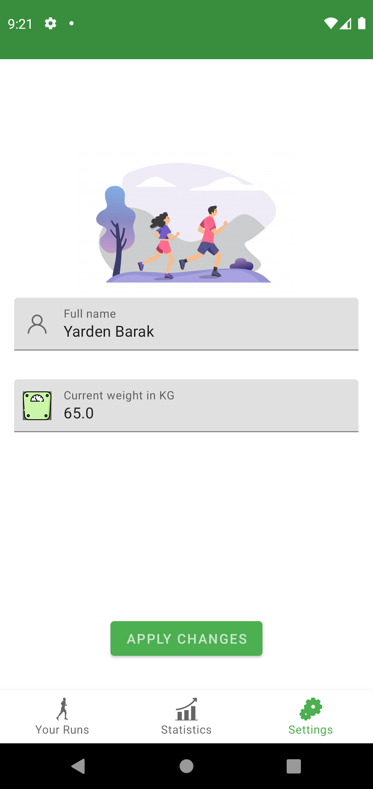
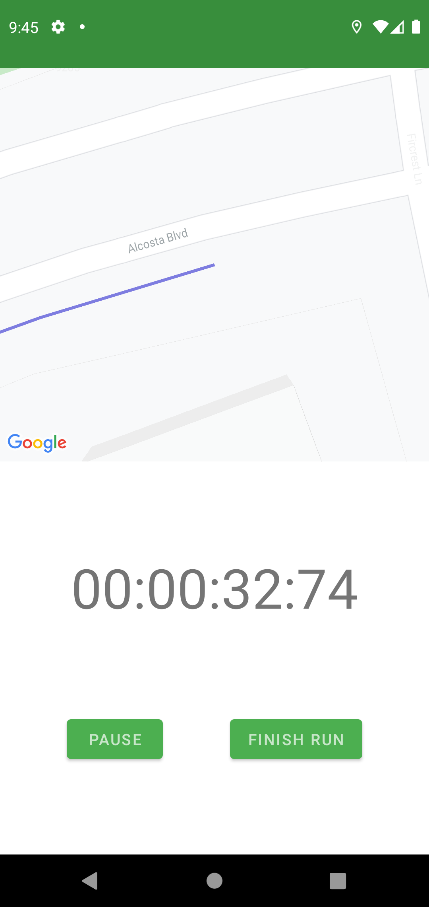
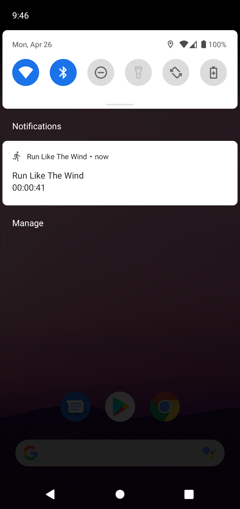
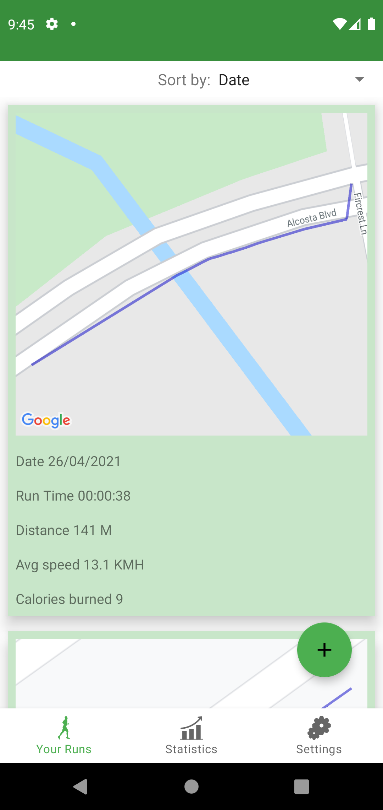
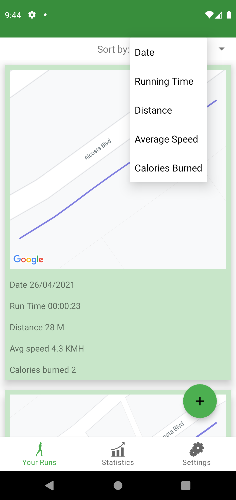
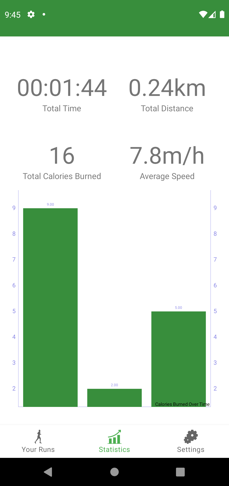

A running app which tracks the user's location and draws on the map according to the route the user ran and follows him in real time by zooming to his current location.
I used MVVM, Google maps, SharedPreferences, Room DB, Lifecycle, navigation fragment, and Glide.

